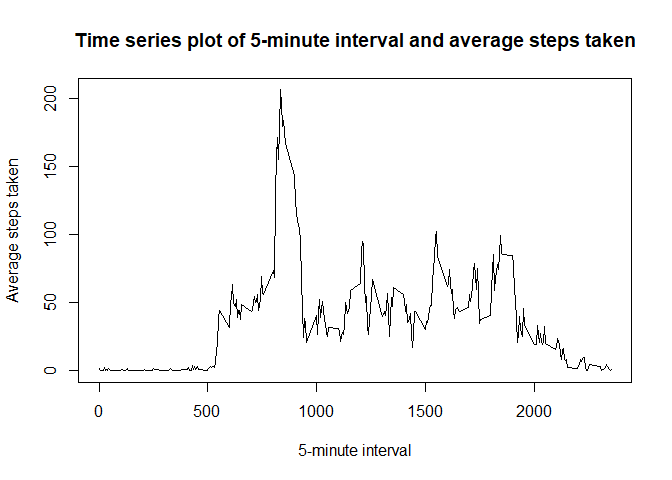

## Loading and preprocessing the data

Load required packages:

```r
library(ggplot2)
library(plyr)
```

Reading in the data and transforming the date into a date value

```r
data <- read.csv("activity.csv")
data$date <- as.Date(as.character(data$date))
```
Setting the locale for English weekdays

```r
Sys.setlocale("LC_TIME", "C")
```

## What is mean total number of steps taken per day?

The number of steps taken each day is as follows:

```r
totalPerDay <-tapply(data$steps, data$date, sum)
df<- data.frame(rownames(totalPerDay), totalPerDay)
names(df) <- c("Date", "Total Steps")
rownames(df) <- NULL
print(df)
```

```
##          Date Total Steps
## 1  2012-10-01          NA
## 2  2012-10-02         126
## 3  2012-10-03       11352
## 4  2012-10-04       12116
## 5  2012-10-05       13294
## 6  2012-10-06       15420
## 7  2012-10-07       11015
## 8  2012-10-08          NA
## 9  2012-10-09       12811
## 10 2012-10-10        9900
## 11 2012-10-11       10304
## 12 2012-10-12       17382
## 13 2012-10-13       12426
## 14 2012-10-14       15098
## 15 2012-10-15       10139
## 16 2012-10-16       15084
## 17 2012-10-17       13452
## 18 2012-10-18       10056
## 19 2012-10-19       11829
## 20 2012-10-20       10395
## 21 2012-10-21        8821
## 22 2012-10-22       13460
## 23 2012-10-23        8918
## 24 2012-10-24        8355
## 25 2012-10-25        2492
## 26 2012-10-26        6778
## 27 2012-10-27       10119
## 28 2012-10-28       11458
## 29 2012-10-29        5018
## 30 2012-10-30        9819
## 31 2012-10-31       15414
## 32 2012-11-01          NA
## 33 2012-11-02       10600
## 34 2012-11-03       10571
## 35 2012-11-04          NA
## 36 2012-11-05       10439
## 37 2012-11-06        8334
## 38 2012-11-07       12883
## 39 2012-11-08        3219
## 40 2012-11-09          NA
## 41 2012-11-10          NA
## 42 2012-11-11       12608
## 43 2012-11-12       10765
## 44 2012-11-13        7336
## 45 2012-11-14          NA
## 46 2012-11-15          41
## 47 2012-11-16        5441
## 48 2012-11-17       14339
## 49 2012-11-18       15110
## 50 2012-11-19        8841
## 51 2012-11-20        4472
## 52 2012-11-21       12787
## 53 2012-11-22       20427
## 54 2012-11-23       21194
## 55 2012-11-24       14478
## 56 2012-11-25       11834
## 57 2012-11-26       11162
## 58 2012-11-27       13646
## 59 2012-11-28       10183
## 60 2012-11-29        7047
## 61 2012-11-30          NA
```

Now put it in a histogram

```r
hist(df$"Total Steps", main ="Histogram of total steps taken per day", xlab = "Total Steps")
```

<!-- -->

Report the mean and median of the total steps taken per day:

```r
mean(df$'Total Steps', na.rm = TRUE)
```

```
## [1] 10766.19
```

```r
median(df$'Total Steps', na.rm = TRUE)
```

```
## [1] 10765
```

## What is the average daily activity pattern?

Create a time series plot of the 5-minute interval and the average steps taken

```r
data2 <- ddply(data, ~ interval, summarise, avg=mean(steps, na.rm=TRUE)) 
plot(data2$interval, data2$avg, type = "l", xlab="5-minute interval", ylab = "Average steps taken", main = "Time series plot of 5-minute interval and average steps taken")
```

<!-- -->

The 5-minute interval with on average the maximum steps taken is:

```r
as.numeric(data2[data2$avg==max(data2$avg),1])
```

```
## [1] 835
```

## Imputing missing values

Count the total number of values in the dataset:


```r
table <- table(is.na(data$steps))
table <- table["TRUE"]
names(table) <- "Number of NA"
print(table)
```

```
## Number of NA 
##         2304
```

Replace missing values with average per 5-minute interval. A new dataset is created and a table shows that there are no missing values left

```r
library(plyr)
impute.mean <- function(x) replace(x, is.na(x), mean(x, na.rm = TRUE))
data3 <- ddply(data, ~ interval, transform, steps = impute.mean(steps))
table(is.na(data3))
```

```
## 
## FALSE 
## 52704
```

A historgram on the new dataset shows that the data has changed

```r
totalPerDay <-tapply(data3$steps, data3$date, sum)
df<- data.frame(rownames(totalPerDay), totalPerDay)
names(df) <- c("Date", "Total Steps")
rownames(df) <- NULL

hist(df$"Total Steps", main ="Histogram of total steps taken per day", xlab = "Total Steps")
```

<!-- -->

The mean has not changed, the median slightly

```r
mean(df$'Total Steps')
```

```
## [1] 10766.19
```

```r
median(df$'Total Steps')
```

```
## [1] 10766.19
```

## Are there differences in activity patterns between weekdays and weekends?

reate new variable which indicates whether its a weekday or a weekend day

```r
data3$daytype <- weekdays(data3$date)
data3$daytype <- ifelse(data3$daytype == "Saturday" | data3$daytype =="Sunday", "Weekend", "Weekday")
```

Create panel plot

```r
data4 <- ddply(data3, .(interval,daytype), summarise, avg=mean(steps, na.rm=TRUE)) 
ggplot(data4, aes(x=interval, y=avg)) + geom_line()+ facet_grid(daytype~.)
```

<!-- -->
